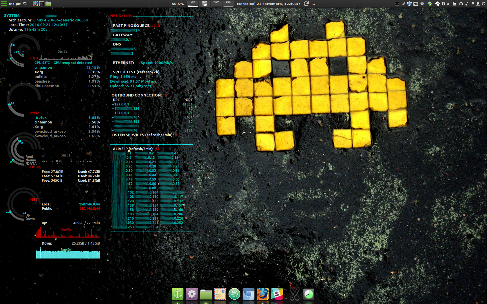

# Screenshot


# Prerequisites
The ```conky``` software is *required* and ```conky-manager``` is useful to run the dual panel included in this theme.
For *conky-manager* I used the next repo:
```sudo add-apt-repository ppa:teejee2008/ppa; sudo apt update```

# Install the theme:
```$ cd /tmp; git clone https://github.com/dvdred/mint-themes.git; mv mint-themes/ConkyThemes/CyanNet ~/.conky```

## Only for the "conky_netmap" you need:

```
sudo apt install -y fping nmap sockstat
wget -O speedtest-cli https://raw.githubusercontent.com/sivel/speedtest-cli/master/speedtest.py && chmod +x speedtest-cli && sudo mv speedtest-cli /bin/
MY_USER=$(whoami) && echo '# Permission to socket stats' > /tmp/conky_cyan; echo "$MY_USER ALL=NOPASSWD: /usr/bin/sockstat" >> /tmp/conky_cyan;
sudo chown root. /tmp/conky_cyan; sudo mv /tmp/conky_cyan /etc/sudoers.d/
```

# Customization
DEFAULTS value in the configuration file ```conky_cyan```
- ```template1``` ("wlp3s0") name of the active network interfaces
- ```template2``` ("/DATA") First custom folder to watch other than root
- ```template3``` ("/Share") Second custom folder to watch other than root

DEFAULTS value in the configuration file ```conky_cyan```

- ```
## LowRefreshRate (default 2 hours)
template1 7200
## MediumRefreshRate (default 10 min)
template2 600
## HighRefreshRate (default 3 min)
template3 180
```

# Fix and Feature

- Fixed syntax for conky version released with Linux Mint 18
- Fixed visualization distorsion
- Customized color of some elements, included graph
- Added a new conky conf for network advanced information and discovery (use conky-manager to have both displayed). Read the EXTRA notes for use it.
- Parametrized all possible variable (*)
* SOMEONE smarter than me can discover howto dinamically retrive the name of active interface to make possible to valorize "template1" variable !

# Many Thanks to the author of the original theme (Green Apple Desktop). You can include my fixes if you wish.
